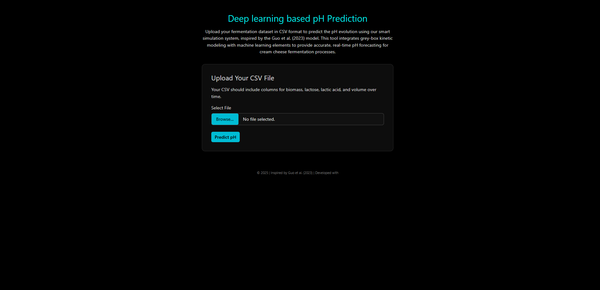
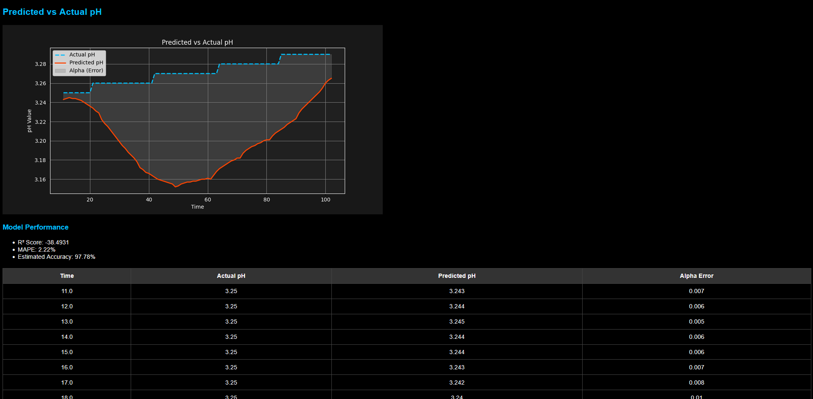

### Chemical Mixing Data Synthesis  
### Deep Learning pH Prediction System

A smart web app for predicting pH changes during cream cheese fermentation using a hybrid **grey-box model**, combining **reaction kinetics** with **neural networks** (via TensorFlow). Inspired by **Guo et al. (2023)**.

  

---

### Features

- Upload a CSV file containing time-series fermentation data  
- Predict pH values using a kinetic + LSTM model  
- Built with a Python backend and HTML/CSS/JavaScript frontend  
- Integrated TensorFlow (Go/Python bindings)  
- Frontend hosted with static HTML, CSS, and JavaScript  
- Backend handles CSV parsing, kinetic simulation, and pH forecasting  

---

### How to Test the Product -- Windows

- Install **TensorFlow**, **Flask**, and make sure you have the latest version of **Python** installed  
- Clone the GitHub repository  
- Navigate to the `GenerateData` folder and run `main.go`  
  This will generate a folder with CSV data

  You can modify various parameters in the data generation process:
  - Initial biomass  
  - Temperature  
  - Time steps during cooking  
  - Variation periods in the fermentation process

- Navigate to the `lstme` folder and train the LSTM model using the generated CSV files  
  > This is not mandatory the current model is already trained with sufficent CSV files but it can be improved upon
- Run the API server using Flask  
- Open the development address in your browser to access the web interface  
  > Note: The website is not deployed due to hosting costs and limited funding  

- Upload one of the generated CSV files through the interface  
  > Note: The LSTM model does **not** use the `pH` column to make predictions — it learns from other features

---

### Probable Use

Companies can integrate this method into their fermentation process to:
- Accurately predict pH behavior  
- Reduce trial-and-error in R&D  
- Save costs through smarter bioprocess optimization  
